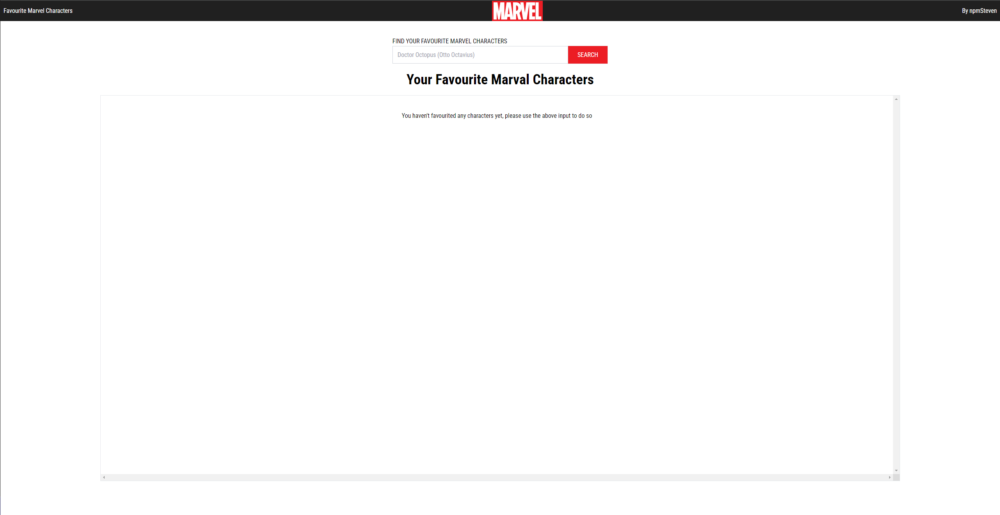
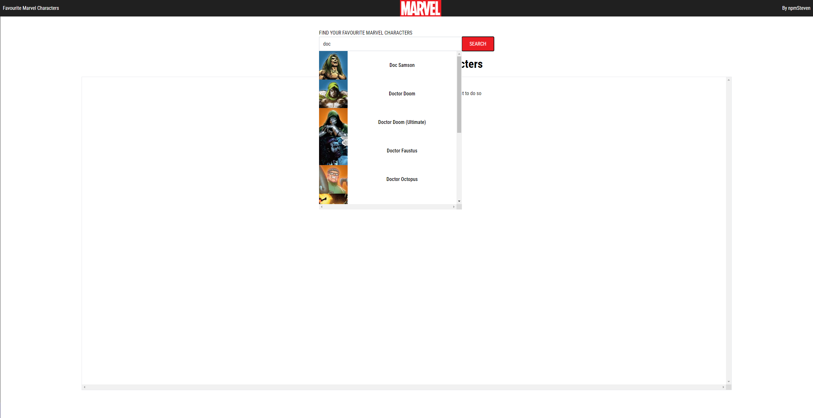
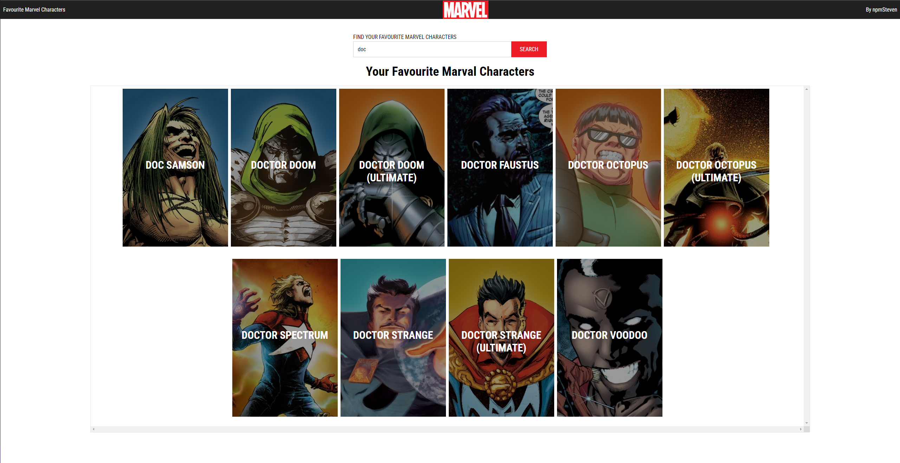

# Favourite Marvel Characters
A simple app that allow you to call the marvel api and favourite your most loved marvel characters

Main Page

Main Page with Search

Main Page with favourited characters

## Project Details

### Future Improvements
- Make it mobile responsive
- Split out the tests & have more tests
- Seperate some of the components out from the App file
- Implement infinite loading when fetching characters from the marvel api
- Add option to order your favourite marvel characters with drag-n-drop
- Make autocomplete component more robust by making some props optional and having more props for example options to have multiple buttons on the left or right.
- Improve the intellisense with jsdoc over the whole app
- When you hover over one of your favourited character I could show details about the character or there stats
- Extract the api call into it's own services, to make it easier to take advantage of marvels other apis

### Example Improvements and how I'd implement them
1. Implement infinite loading
  - To implement infinite loading set up state to manage data and loading status, create a function to fetch data with pagination, and use a scroll event listener to trigger data fetching when the user nears the bottom of the list. Update the state with the new data and display a loading indicator while fetching.
2. Add option to order favourited marvel characters with dnd
  - To add the option to order favorited Marvel characters with drag-and-drop (DnD), I'd use a library like react-beautiful-dnd to manage the drag-and-drop functionality, updating the state to reflect the new order of characters whenever a drag-and-drop action occurs.

### Challenges
- One issue I had was trying to keep the dropdown for the autocomplete open when clicking on the search button, as originally it wasn't inside of the autocomplete component, so I had to merge them to ensure I that I'd know what is in focus and when it isn't.

### Highlights
- I added a custom marvel themed loader for when the autocomplete is finding the character you want, it'll pulse. You don't really get the chance to see it pulse as the API call is pretty quick

## Setup

### Requirements
- [NodeJS 20 or greater](https://nodejs.org/en/download/package-manager)
- pnpm `npm i -g pnpm`

### Clone the repo
- `git clone git@github.com:npmSteven/favourite-marvel-characters.git`
- `cd favourite-marvel-characters`

### Create a file in the root of the project `.env`
- `VITE_API_URL` = `https://gateway.marvel.com:443/v1/public`
- `VITE_API_KEY` = `your-api-key` to get the api key go to https://developer.marvel.com/

### Install dependencies
- `pnpm i`

### Run the app in develop mode
When accessing the app ensure you are using localhost
- `pnpm run dev`

### Run and build the app
- Creates a build `pnpm run build`
- Runs the built code `pnpm run start`

### How to run the tests for the app
- Run the tests `pnpm run test`

